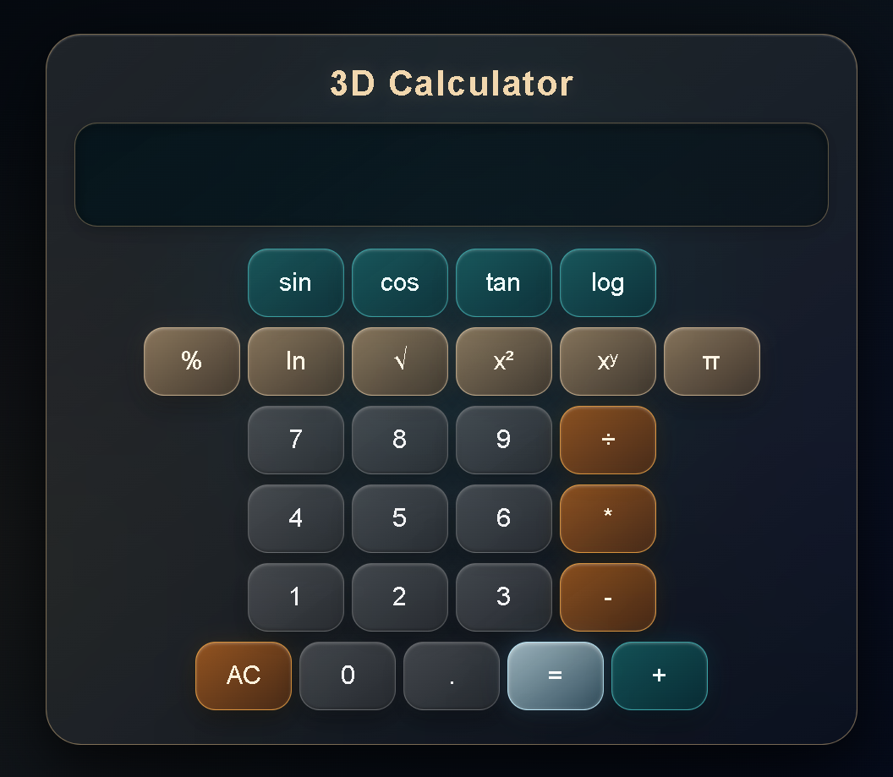

````markdown
# 3D Scientific Calculator 🧮

A full-stack **3D Scientific Calculator** developed as a Semester 3 academic project using HTML, CSS, JavaScript, PHP, Python, MySQL, and CSV.

The project combines a 3D/glassmorphism user interface with a Python calculation engine, PHP backend integration, MySQL-based calculator settings, and automatic CSV calculation history.

---

## Preview



---

## ✨ Features

### Basic Operations

- Addition
- Subtraction
- Multiplication
- Division
- Percentage
- Decimal numbers

### Scientific Operations

- `sin`
- `cos`
- `tan`
- `log`
- `ln`
- Square root `√`
- Square `x²`
- Power `xʸ`
- Percentage `%`
- Pi `π`

### Interface

- 3D calculator design
- Glassmorphism-inspired interface
- Responsive layout
- Scientific calculator layout
- Separate expression and result display
- Large result display
- JavaScript-based interaction

### Error Handling

The calculator handles errors such as:

- Division by zero
- Square root of negative numbers
- Invalid logarithm input
- Invalid numerical input
- Invalid operators

### Calculator Settings

MySQL stores:

- Decimal precision
- Angle mode
- Theme name

Current configuration:

```text
Decimal Places: 10
Angle Mode: DEG
Theme: 3D Glass
```
````

### Calculation History

Successful calculations are automatically saved to:

```text
data/calculation_history.csv
```

The CSV file is generated at runtime and is excluded from Git.

---

## 🏗️ Project Structure

```text
3D-Calculator/
│
├── frontend/
│   ├── index.html
│   ├── style.css
│   └── script.js
│
├── backend/
│   ├── calculate.php
│   └── db.php
│
├── python/
│   └── calculator.py
│
├── database/
│   └── calculator_db.sql
│
├── data/
│   └── .gitkeep
│
├── docs/
│   ├── architecture.md
│   └── setup.md
│
├── .env.example
├── .gitignore
├── LICENSE
└── README.md
```

---

## 🛠️ Tech Stack

| Component                   | Technology              |
| --------------------------- | ----------------------- |
| Frontend                    | HTML5, CSS3, JavaScript |
| Backend                     | PHP                     |
| Calculation Engine          | Python 3                |
| Database                    | MySQL                   |
| Database Connection         | PHP `mysqli`            |
| Data Logging                | CSV                     |
| Client-Server Communication | HTTP POST / Fetch API   |

---

## 🧩 Architecture

```text
                    ┌──────────────────────┐
                    │       Browser        │
                    │   HTML / CSS / JS    │
                    └──────────┬───────────┘
                               │
                         HTTP POST
                               │
                               ▼
                    ┌──────────────────────┐
                    │   calculate.php      │
                    │       PHP            │
                    └───────┬───────┬──────┘
                            │       │
                            │       └──────────────┐
                            ▼                      ▼
                    ┌──────────────┐      ┌────────────────┐
                    │    MySQL     │      │ calculator.py  │
                    │   Settings   │      │     Python     │
                    └──────────────┘      └───────┬────────┘
                                                  │
                                           Successful
                                           calculation
                                                  │
                                                  ▼
                                      ┌────────────────────┐
                                      │ calculation_history│
                                      │       .csv         │
                                      └────────────────────┘
```

### Request Flow

1. The user enters a calculation in the frontend.
2. JavaScript sends the calculation to `backend/calculate.php`.
3. PHP retrieves the calculator settings from MySQL.
4. PHP calls `calculator.py`.
5. Python performs the calculation.
6. Python returns the result as JSON.
7. PHP applies the configured decimal precision.
8. JavaScript displays the result.
9. Successful calculations are automatically saved to the CSV file.

---

# 🚀 Setup & Installation

## Prerequisites

Install:

- PHP 7.4 or later
- MySQL 8.x or compatible MariaDB
- Python 3.x
- Git
- A modern web browser

---

## 1. Clone the Repository

```bash
git clone https://github.com/ishaansingh657-sketch/3D-Calculator.git
cd 3D-Calculator
```

---

## 2. Configure Environment Variables

The repository contains:

```text
.env.example
```

Example:

```env
DB_PASSWORD=your_mysql_password
PYTHON_EXECUTABLE=python
```

The PHP backend reads these values using `getenv()`.

Configure the required environment variables in your operating system or server environment.

**Do not commit real passwords or other secrets to GitHub.**

---

## 3. Set Up the Database

The database schema is located at:

```text
database/calculator_db.sql
```

Run the SQL file using MySQL or a database management tool such as phpMyAdmin.

It creates:

```text
Database: calculator_db
Table: calculator_settings
```

Default settings:

```text
decimal_places = 10
angle_mode     = DEG
theme          = 3D Glass
```

---

## 4. Configure MySQL

The database connection is defined in:

```text
backend/db.php
```

The project uses MySQL for storing calculator settings.

The database password is read from:

```text
DB_PASSWORD
```

Make sure your MySQL server is running and that the database configuration matches your local environment.

---

## 5. Configure Python

The calculation engine is located at:

```text
python/calculator.py
```

The PHP backend uses:

```text
PYTHON_EXECUTABLE
```

Example:

```env
PYTHON_EXECUTABLE=python
```

---

## 6. Start the Application

From the project root:

```powershell
php -S localhost:8000
```

Then open:

```text
http://localhost:8000/frontend/
```

---

# 🧪 Testing

| Test       |        Expected Result |
| ---------- | ---------------------: |
| `7 + 3`    |                   `10` |
| `9 ÷ 0`    | Division-by-zero error |
| `sin(90)`  |                    `1` |
| `cos(0)`   |                    `1` |
| `tan(45)`  |                    `1` |
| `√25`      |                    `5` |
| `5 x²`     |                   `25` |
| `2 xʸ 10`  |                 `1024` |
| `log(100)` |                    `2` |
| `ln(1)`    |                    `0` |

---

# 🐍 Python Calculation Engine

The calculation engine is:

```text
python/calculator.py
```

It uses Python standard libraries for calculation, JSON handling, CSV logging, file handling, and date/time operations.

### Supported Operators

```text
+
-
*
/
^
%
percent
sqrt
square
sin
cos
tan
log
ln
```

The Python engine supports both `DEG` and `RAD` for trigonometric calculations.

The current calculator configuration is:

```text
DEG
```

### Examples

```bash
python calculator.py 10 + 5
```

Output:

```json
{ "result": 15.0 }
```

Square root:

```bash
python calculator.py 25 sqrt
```

Output:

```json
{ "result": 5.0 }
```

Division by zero:

```bash
python calculator.py 9 / 0
```

Output:

```json
{ "result": "Error: Cannot divide by zero" }
```

---

# 🗄️ Database

## `calculator_settings`

| Column           | Type        | Default        |
| ---------------- | ----------- | -------------- |
| `id`             | INT         | Auto Increment |
| `decimal_places` | INT         | `10`           |
| `angle_mode`     | VARCHAR(20) | `DEG`          |
| `theme`          | VARCHAR(50) | `3D Glass`     |

---

# 📊 Calculation History

Successful calculations are automatically saved to:

```text
data/calculation_history.csv
```

### CSV Fields

```text
Date & Time
First Number
Operator
Second Number
Result
```

The calculation history file is generated at runtime and excluded from Git.

---

# 🔐 Security

- Real passwords and secrets must not be committed to GitHub.
- `.env` files are excluded through `.gitignore`.
- `.env.example` contains placeholder values only.
- The database password is supplied through an environment variable.
- Runtime calculation history is excluded from Git.

---

# 📁 Documentation

Additional project documentation is available in:

```text
docs/
├── architecture.md
└── setup.md
```

---

# 📜 License

**All Rights Reserved.**

This project is provided for academic evaluation and portfolio purposes.

Viewing the public GitHub repository does not grant permission to copy, modify, redistribute, publish, sublicense, or incorporate the source code into another project without prior written permission from the author.

See the `LICENSE` file for the complete terms.

---

# 👨‍💻 Author

**Ishaan Singh**

BCA — Semester 3
Symbiosis Institute of Computer Studies and Research (SICSR)
Symbiosis International (Deemed University)

---

**Built with HTML · CSS · JavaScript · PHP · Python · MySQL**
